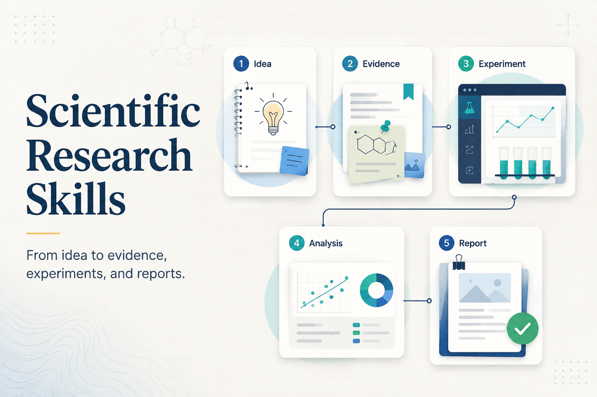

# Scientific Research Skills

Codex skills for rigorous scientific research workflows across domains.

This repository currently contains `scientific-research`, a Codex-native skill for moving from a research question to literature grounding, hypothesis exploration, experiment or study planning, data analysis, report writing, internal review, revision, and AI-use disclosure.

The workflow supports structured research practice, including hypothesis development, evidence tracking, experiment planning, writing, and review. It does not require users to provide extra model API keys beyond the active Codex environment.



## Install For Codex

From this repository:

```bash
mkdir -p "${CODEX_HOME:-$HOME/.codex}/skills"
cp -R skills/scientific-research "${CODEX_HOME:-$HOME/.codex}/skills/"
```

Restart Codex, then invoke:

```text
$scientific-research
```

Example requests:

```text
Use $scientific-research to turn this broad topic into a research plan.
Use $scientific-research to design a reproducible benchmark study.
Use $scientific-research to review this manuscript for unsupported claims and missing disclosure.
```

## Install For Claude Code

Claude Code can use this skill as a standard `SKILL.md` skill. Install it as a personal skill:

```bash
mkdir -p "$HOME/.claude/skills"
cp -R skills/scientific-research "$HOME/.claude/skills/"
```

Then start Claude Code in any project:

```bash
claude
```

Invoke the skill directly:

```text
/scientific-research
```

Or ask Claude Code for a research workflow in natural language and let it load the skill when relevant. If Claude Code was already running before the skills directory existed, restart it so the new skill directory is discovered.

Claude Code skill documentation: <https://code.claude.com/docs/en/skills>

## What It Does

- Formulates research contracts with assumptions, acceptance criteria, and evidence needs.
- Builds and ranks candidate hypothesis or method portfolios.
- Guides literature review and novelty checks without fabricating citations.
- Designs computational experiments, observational studies, surveys, or protocol-only lab/clinical workflows.
- Supports data analysis, uncertainty reporting, robustness checks, and evidence ledgers.
- Drafts and reviews reports or manuscripts with explicit AI-use disclosure.

## Safety Boundaries

- No external service or cloud API keys are required by the skill.
- It does not read secrets such as `.env` files, credentials, private keys, tokens, or unrelated personal files.
- It does not execute unsafe wet-lab, clinical, human-subjects, or dual-use work. For those areas it produces protocol, ethics, and risk-review artifacts only.
- It does not present machine-generated research artifacts as human-authored.

## Helper Scripts

```bash
python3 skills/scientific-research/scripts/validate_research_artifacts.py --root path/to/artifacts
python3 skills/scientific-research/scripts/summarize_hypotheses.py --input path/to/hypothesis_portfolio.json
```

Both scripts use only the Python standard library.

## License

Original content in this repository is released under the MIT License.
